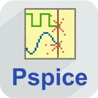

<h1 align="center">Kamaleshwaran M</h1>
<h3 align="center">Electronics and Communication Engineering student (2nd year)</h3>
<h3 align="center">IoT | ML | Embedded Systems</h3>
  

📫 Email: <b>klr969496@gmail.com</b>

---

## 👨‍💻 About Me  

### Electronics Student | ML | IoT & Embedded Systems  

🔹 Interested in building systems that combine **Machine Learning**, **IoT**, and **Embedded hardware**.

🔹 Focused on understanding **Sensor integration**, **Real-time data processing**, and **Basic ML applications** in embedded environments.

🔹 **Currently Working On**: Edge Intelligence-based Smart Soldier Safety Monitoring System (IEEE project).

🔹 **Learning**: Machine learning fundamentals, Embedded system design, and IoT communication technologies.

## 🎯 My Goals  

🔹 Apply machine learning in **real-world embedded and IoT systems**. 

🔹 Improve understanding of **low-power system design and communication protocols**.

🔹 Build and document projects combining **ML, IoT, and embedded systems**.

🔹 Develop practical skills for **engineering and problem-solving** in this domain.

---

<h3 align="left">Connect with me:</h3>

 

---

### IDE and Tools I Use:

  

  

  

  
  &nbsp;
  

  

  

---

## 🔧 Projects

### 𖥂 Embedded Systems & IoT (Initial Work)  

✔️ Weather Monitoring and Forecasting Drone (prototype stage).  

✔️ Basic experience in sensor integration and system setup.  

### 🪖 Edge Intelligence-based Smart Soldier Safety Monitoring System (Ongoing)  

✔️ IEEE paper project on Real-time Soldier Safety Monitoring using Edge Intelligence with a simple ML model.  

✔️ ESP32 WROOM-32 microcontroller and LoRa-based communication between transmitter and receiver (LoRa Ra-02 module is used).  

✔️ Sensor integration: MAX30102 (Heart Rate + SpO2), MPU6050 (Motion), DHT22 (Temperature and Humidity), GPS NEO-6M.  

✔️ Simple ML model-Decision Tree for basic health risk prediction.  

✔️ AWS cloud integration for data storage and monitoring.  
 

### ⚡ Power & Communication Improvements (Upcoming)  

✔️ Continuation of the Edge Intelligence-based Smart Soldier Safety Monitoring System.  

✔️ Power stability using Lithium-ion battery with AMS1117-3.3V Voltage regulator module and TP4056 Battery Protection (BMS) module.  

✔️ These AMS1117-3.3V and TP4056 module is to prevent damage due to voltage fluctuations caused by Lithium-ion battery.  

✔️ Secure LoRa communication using data encryption.  

✔️ Focus on low-power and reliable deployment.  

---
